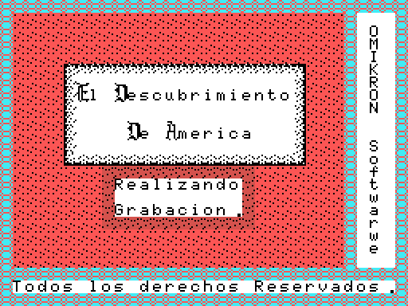

# Findings

What turned up when the tape was taken apart. Everything here is **measured**
-by running the format, by reading the constants the code itself counts with, or
by cross-checking against the machine- not deduced from how the bytes look. What
is not settled is not here: it is in [Open questions](OPEN-QUESTIONS.md).

## 0xD300 is not code: it is a pointer

The `CARGA` binary runs from 0xC000 to 0xD3DF, but its execution address is
**0xD302**, not 0xD300. The reason is in those two bytes: they hold `69 D3`, the
word **0xD369**, which is the loop that reads a tape block.

The first half of the game ends like this:

    5CC2  ld hl,(0xD300)
    5CC5  push hl
    5CC6  ret

That is how it returns to the loader to ask for the second half **without
carrying the address in its own code**. The loader at 0xD300-0xD3DF survives
both programs because no tape block reaches past 0xD2FF.

## The BIOS never reads the two big blocks

Files 04 and 05 on the tape have no header. The loop at 0xD369 reads them by
hand with TAPION and TAPIN, byte by byte, and splits each into three sync bytes
(`03 02 01`), 0x2400 bytes at 0x4000 and 0x5300 bytes at 0x8000.

    3 + 9216 + 21248 = 30467

which is exactly what block 05 measures. Block 04 is five bytes longer, and they
are `.cas` alignment padding: zeros, checked.

Hence the **two halves of the game occupying exactly the same addresses**, and
hence this disassembly being five listings and not one.

## Inside the caravel: 128 x 52 tiles

The second half does not play out in screens: it plays out inside a longitudinal
cutaway of the ship, **1024 x 416 pixels**, with the deck, three masts with
their sails and rigging ladders, and three runs of cabins and hold below.

The 0x1A00 bytes run from 0x9000 to 0xA9FF. What says the width is 128 is **no
declared constant at all**: it is the 0x80 step between rows in the loop at
0x4285. The check that it is read right is that the 32x24 window the game cuts
matches the emulator across **all 768 tiles, zero differences**.

## What you buy is drawn stowed in the hold

The five commodities are bought at the quayside warehouse, each costing one of
the sixteen units of MONEY. But the number does not stay in a counter: the
routine at **0x4F60** in the second half stows the cargo in the hold, **one pile
per commodity and as many pieces as units remain**.

Drawn out, the tiles of each pile are staved barrels for water and wine
(0xBF-0xC4), tied sacks for food (0xB9-0xBE), stacked planks (0xC6-0xC8) and
rolls of cloth (0xC5, 0xC9 and 0xCA).

## Which counter is which has to be measured, and the handover crosses them

At the end of the first half there is a summary with seven figures. The labels
are **artwork, not text**, so which is which cannot be assumed — and this
disassembly's first attempt had it wrong.

How to measure it: the loop at 0x5D0C paints the fourteen digits on
**consecutive** tiles from 188 on, so it is enough to look those tiles up in the
name table at 0xC310 to see which label each one falls under.

| counter | label | row, column | goes to |
|---|---|---|---|
| 0xF8B4 | water | 13, 9 | 0xD6D9 -> 0xF39A |
| 0xF8B5 | wine | 18, 9 | 0xD6DA -> 0xF39B |
| 0xF8B6 | food | 8, 9 | 0xD6DD -> 0xF39E |
| 0xF8B7 | timber | 5, 22 | 0xD6DB -> 0xF39C |
| 0xF8B8 | cloth | 12, 22 | 0xD6DC -> 0xF39D |
| 0xF8B9 | crew | 17, 22 | 0xD6DE -> 0xF39F |
| 0xF8BA | money | 4, 9 | not handed over |

They follow neither the order of the addresses nor the order on screen, and the
trip through 0xD6D9 **crosses food with timber**. A test pins the positions.

With that table in hand the second half reads itself: 0xF39A and 0xF39B are the
drink and are used one after the other -water first, then wine-, 0xF39E is the
food and has its own cycle, 0xF39C is the timber that plugs the leak, 0xF39D the
cloth that smothers the fire, and 0xF39F how much crew is aboard.

## 7,564 bytes nobody reads, and one stretch of them is a snapshot of memory

The tape records **fixed-size** blocks no matter what, but the first half's
program ends at 0x5F9F and the second's at 0x5C3F. Whatever was in memory got
recorded behind them: **7,564 bytes out of 66,016, 11.5%**, identified and
accounted for but touched by no instruction.

One of those leftovers can be read in full. From 0xCC56 to 0xD2FF the first half
carries **1,706 bytes identical to the `CARGA` file but for a single byte**
-0xCC56 itself, which is 0x1F there and 0x19 here-. It is the loading screen,
still sat in memory when the block was recorded. Nobody reads it: the only
routine that would upload it is the one at 0xD330, and that only runs on entry
through 0xD302, which had already happened before that block existed.

The second half, at the same addresses, carries something else: only 4.1% of the
bytes match.

## All three programs end with a truncated copy of themselves

All three end with a stretch of their own code repeated, always cut
mid-instruction:

| program | leftover | copy of |
|---|---|---|
| `carga` | 0xD3D8-0xD3DF | 0xD358-0xD35F |
| first half | 0x5F9F-0x5FF7 | 0x5F1F-0x5F77, 0x80 higher up |
| second half | 0x5C42-0x5C79 | 0x5BC2-0x5BF9 |

All three checked byte for byte. Nobody executes them; it looks like a slip of
whatever tool the blocks were built with.

## The publisher's signature carries a typo, and it is on the tape

Decoding the name table at 0xD000, down the right margin of the loading screen
you read **"OMIKRON Softwarwe"**, with two w's. The typo is on the tape, not in
this disassembly, and a test pins it.

The letters are not ASCII: they are tile indices, and they use **two different
alphabets inside the same table** -0x00-0x19 and 0x20-0x39, two sets of tiles
for the same twenty-six letters- plus six tiles (0x3A-0x3F) for the tall
two-tile capitals that start "El", "Descubrimiento" and "America". The space is
0xFF.

## A flag hidden inside the artwork itself

The first half's start-up does:

    420A  ld a,(0xC103)
    420D  cp 8
    420F  call nz, voltea_los_patrones

0xC103 is not a variable: it is a byte **of the pattern table**, used as a flag
so the same artwork is not flipped twice. The routine at 0x561D reverses the bit
order of every byte between 0xC102 and 0xC138, which is how the game gets its
mirrored artwork without spending any more tape.

## The music only hangs off the interrupt in the first half

The first half installs a `JP` at H.KEYI (0xFD9F) pointing to 0x4046, and the
music plays on every scan interrupt, before the BIOS reads the keyboard. The
state is fourteen consecutive bytes (0xF8CB-0xF8D8) with **three bytes per
channel**, which is why the cursor at 0x4181 steps by three and the same routine
serves all three channels without a single table. There are sixteen tunes
indexed at 0xCB95.

The second half **installs nothing**: it writes the PSG straight from the main
loop, at 0x5213. Checked by searching for writes to 0xFD9A and 0xFD9F across all
traced code: there are none.

## Screen 7 has no name table of its own

Screens 0 to 6 of the first half each carry their own table, exactly 0x300 bytes
apart, from 0x82F5 to 0x94F5. The seventh does not: it is cut as 32 columns out
of a **64x24** map living at 0x97F5, and the sideways travel is half a screen
-the counter at 0xF89D runs from 0 to 0x20-.

## There is not one credit across the five pieces

Sweeping all five for ASCII strings, only three blocks of text come out: the
opening (0x8200), the eleven on-screen labels (0xC28A) and the five crossing
disasters (0xCBF2). **Not a name, not a set of initials, not a build date.**

The only name on the whole tape is the publisher's, and it is drawn, not
written.
