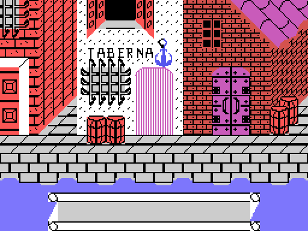
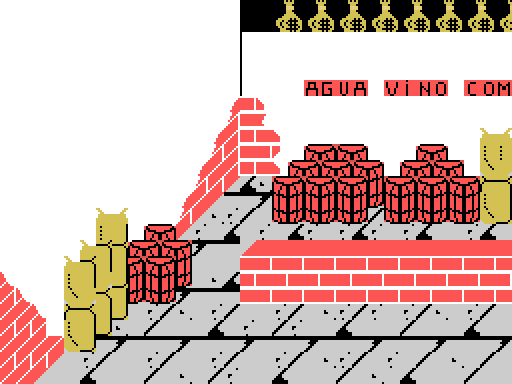
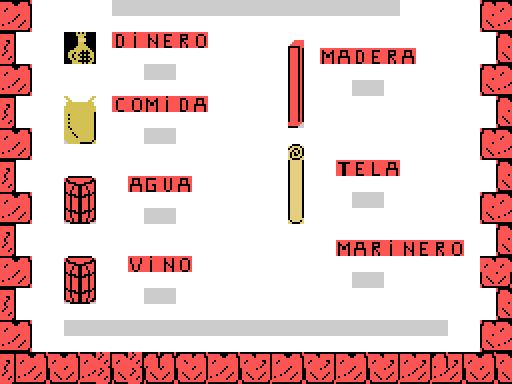
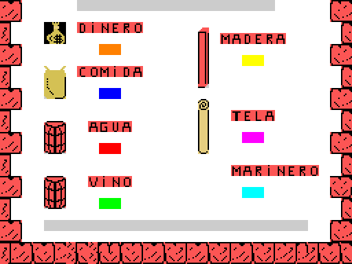
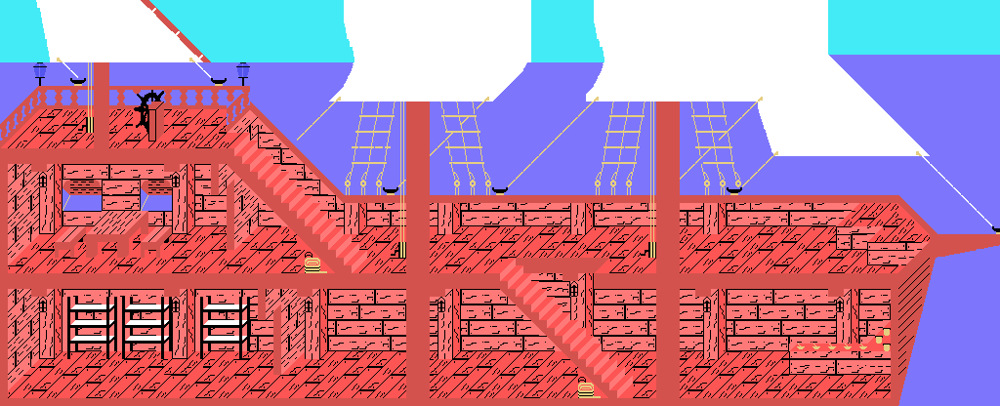
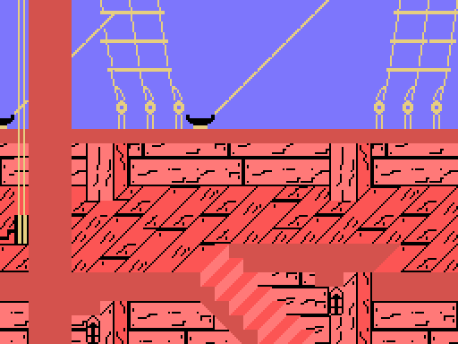
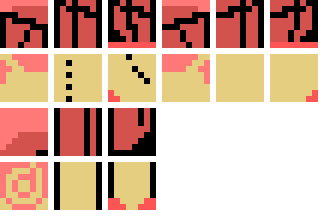
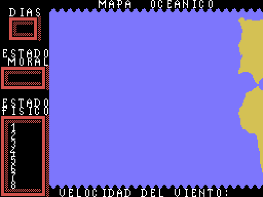
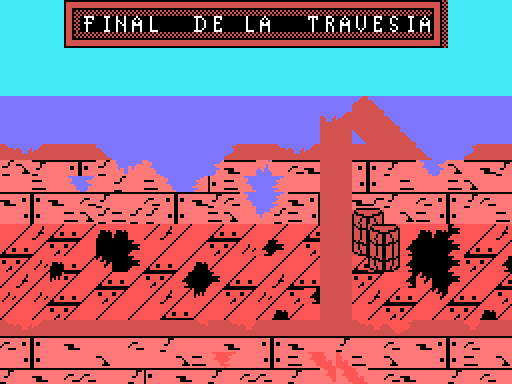

# The game

*El Descubrimiento de America* -"The Discovery of America"- is a game of two
halves, and each is a different genre. In the first you fit out the expedition
around the port of Palos; in the second you cross the Atlantic. Between them
there is a handover of **six bytes**, and nothing else.

Every picture on this page is drawn from the bytes of the tape, not captured
from the emulator.

## The opening text

The text at 0x8200 reads, in the nine-line box the game draws:

> ...ea el puerto de / Palos donde se ar- / men los navios con / todo lo
> necesario / durante un ano. / Como enviado Real / y Almirante de la /
> expedicion sera : / CRISTOBAL COLON

("...the port of Palos, where the ships are to be fitted out with all that is
needed for a year. As Royal envoy and Admiral of the expedition: Christopher
Columbus.") The hyphens are on the tape: the text was written already broken to
nineteen columns.

## The first half: eight screens in Palos

Eight fixed scenes. Seven have their own name table, one after another, exactly
0x300 bytes apart:

| # | table | what is on it |
|---|---|---|
| 0 | 0x82F5 | the harbour street, with the tavern, the quay and the water |
| 1 | 0x85F5 | a studded gate between two houses |
| 2 | 0x88F5 | a courtyard with a staircase and barrels, and a bird crossing |
| 3 | 0x8BF5 | a church: crucifix, altar and stained glass |
| 4 | 0x8EF5 | the map room, with a portrait and a table |
| 5 | 0x91F5 | inside the tavern: bar, stools and a painting of a ship |
| 6 | 0x94F5 | the ship's deck, with the rigging and the barrels |
| 7 | — | the quayside warehouse |

The **seventh has no table of its own**: it is cut as 32 columns out of a
**64x24** map living at 0x97F5, and the sideways travel is half a screen -the
counter at 0xF89D runs from 0 to 0x20-. It is the only screen in the first half
that scrolls.

The eleven labels read across the screens are at 0xC28A: PUERTO DE PALOS, Ano
1492, Fray Juan Perez, Juan de la Cosa, Cartografo, Martin Alonso Pinzon,
Armador, Piloto, Cocinero, Carpintero and Marinero. All of them are drawn with
the BASIC ROM font (CGTABL, 0x1BBF), copied tile by tile into the pattern table.

## What you buy

At the warehouse on screen 7 you buy five commodities -**water, wine, food,
timber and cloth**- each one costing one of the sixteen units of MONEY. The
routine at 0x59FB looks at which stretch of the wide map the figure is standing
on and bumps the right counter.

At the end, a summary with seven figures:

MONEY is the only one shown **subtracted from 16**, that is, what is left; and
CREW comes from the recruitment counter minus two.

## The handover: six bytes and a sway

Six of those seven counters are copied to 0xD6D9-0xD6DE, which sits **above
0xD300** and therefore survives the loading of the second block. The second
half's start-up picks them up and moves them to 0xF39A-0xF39F.

Which is which **cannot be assumed**: the labels are artwork, not text. The way
to measure it is that the loop at 0x5D0C paints the fourteen digits on
**consecutive** tiles from 188 on, so it is enough to look those tiles up in the
name table to see which label each one falls under:

| counter | label | goes to |
|---|---|---|
| 0xF8B4 | water | 0xD6D9 -> 0xF39A |
| 0xF8B5 | wine | 0xD6DA -> 0xF39B |
| 0xF8B6 | food | 0xD6DD -> 0xF39E |
| 0xF8B7 | timber | 0xD6DB -> 0xF39C |
| 0xF8B8 | cloth | 0xD6DC -> 0xF39D |
| 0xF8B9 | crew | 0xD6DE -> 0xF39F |
| 0xF8BA | money | not handed over |

Neither the order of the addresses nor the order on screen, and the trip through
0xD6D9 **crosses food with timber**. A test pins the positions.

And a seventh byte travels, 0xD6D8, which is not a figure but the sway of the
walking figure: both halves use it the same way.

## The second half: inside the caravel

No screens here. There is a **longitudinal cutaway of the ship, 128 x 52
tiles**, and the game cuts a 32x24 window out of it and scrolls it both ways.

The cargo you bought does not stay a number: the routine at 0x4F60 **stows it in
the hold**, one pile per commodity and as many pieces as units remain.

## The crossing

It is played on a **20x20 square chart** (0xC98C-0xCB1B), one byte per square.
The value decides what happens that day: 0 is open sea, 1 and 2 are currents,
and 3 upwards is a setback looked up in the nine-entry table at 0xC968. A test
checks that none of the 400 squares goes above 11, which is what guarantees the
index never runs off the end of the table.

The five disasters are at 0xCBF2, five 22-character strings with no terminator:
GRAVE DESMORALIZACION, AGOTADAS PROVISIONES, VIA DE AGUA SIN TAPAR, FUEGO SIN
CONTROLAR and VELA PRINCIPAL RASGADA -collapse of morale, provisions run out, an
unplugged leak, a fire out of control, and the mainsail torn-. Timber is what
plugs the leak and cloth is what smothers the fire, which is where the circle
closes with what you bought in the first half.

